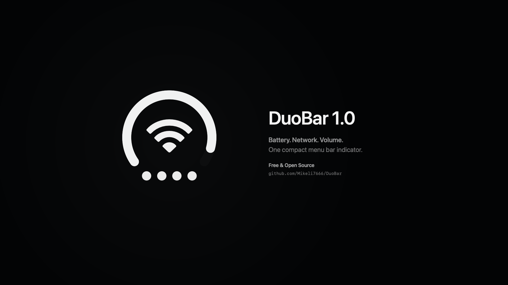

# DuoBar

### One compact macOS menu bar indicator for Battery, Network, and Volume.

**Three live states. One glyph. Less menu bar clutter.**

[**Download DuoBar 1.0**](https://github.com/Mikeli7666/DuoBar/releases/latest) · [**Watch the Launch Film**](https://github.com/Mikeli7666/DuoBar/releases/download/v1.0.0/DuoBar-1.0-Official-Launch-Film.mp4)

macOS 15+ · Apple Silicon · Free & Open Source

 

## One glyph, three live states

DuoBar adapts the iPhone Duo-style three-in-one status concept for the Mac menu bar. One compact glyph presents the system information normally spread across several indicators:

- **Outer arc** → live battery level, with an integrated charging indicator
- **Center** → the active network: Wi-Fi, Ethernet, or an offline/fallback state
- **Four lower dots** → live output volume

Persistent status stays monochrome and native-looking. When AirPods or another supported Bluetooth audio output becomes active, the center briefly transitions from Network → AirPods/headphones → Network. Disconnecting does not trigger an animation.

## DuoBar 1.0

DuoBar 1.0 redesigns the original beta around Battery, Network, and Volume. It adds Ethernet support, live volume and mute controls, Audio Output selection, and temporary AirPods/headphones connection presentation.

[**Watch the DuoBar 1.0 Official Launch Film →**](https://github.com/Mikeli7666/DuoBar/releases/download/v1.0.0/DuoBar-1.0-Official-Launch-Film.mp4)

## Features

- Live battery level, low-battery state, and charging state
- Automatic Wi-Fi, Ethernet, and offline network states
- Four-dot live volume indicator
- Compact volume slider and public Core Audio mute control where supported
- Temporary AirPods/headphones connection presentation
- Compact custom popover: Network, Volume, Battery, Audio Output, Settings, and Quit
- Light and Dark Mode
- Launch at Login
- Native Swift, SwiftUI, and AppKit
- No Dock icon

## Requirements

**macOS 15.0+** 
**Apple Silicon**

## Installation

1. [**Download the latest DuoBar DMG**](https://github.com/Mikeli7666/DuoBar/releases/latest).
2. Open the DMG and drag **DuoBar** into **Applications**.
3. On first launch, Control-click or right-click **DuoBar** in Applications and choose **Open**. If macOS still blocks the app, go to **System Settings → Privacy & Security → Open Anyway**.

> **Why is this extra step needed?** DuoBar is currently distributed independently and is not yet Developer ID notarized, so macOS Gatekeeper may ask for explicit approval on first launch. The source code is public, and DuoBar processes system status locally with no analytics, tracking, telemetry, or backend service.

Never disable Gatekeeper or System Integrity Protection to install DuoBar.

## Permissions

- **Location:** macOS may require authorization before CoreWLAN can expose the current Wi-Fi network name. Denying access does not break basic connection, interface, or signal state; the SSID may simply remain unavailable. DuoBar requests SSID access only when it is useful to the interface.
- **Bluetooth:** DuoBar retains public Bluetooth controller observation while Core Audio provides the primary source for Bluetooth audio endpoints. The app does not manage or pair devices.

## Audio output behavior

Volume control is available only when the active Core Audio output exposes software-settable public volume properties. HDMI, AirPlay, USB, and other external outputs may instead display **Controlled by device**.

AirPods and Bluetooth audio classification is best-effort using public system metadata. DuoBar does not claim exact AirPods generation detection.

## Privacy

- System-status processing occurs locally.
- No analytics or tracking.
- No backend or telemetry.
- No system-status uploads.
- No unrelated network requests.

## Known limitations

- The Wi-Fi network name may be unavailable without Location permission or when macOS withholds it.
- Wi-Fi strength uses documented RSSI data and broad signal ranges; it does not reproduce Apple's private icon algorithm.
- Some audio devices expose fixed or externally controlled volume.
- Bluetooth audio and AirPods family detection is best-effort through public APIs.

## Build from source

Open `DuoBar.xcodeproj` in Xcode, select the **DuoBar** scheme, and run. Debug builds include status simulation and marketing-capture tools; those tools are excluded from Release behavior.

## Disclaimer

DuoBar is an independent project and is not affiliated with or endorsed by Apple Inc.

## License

DuoBar is available under the [MIT License](LICENSE).
